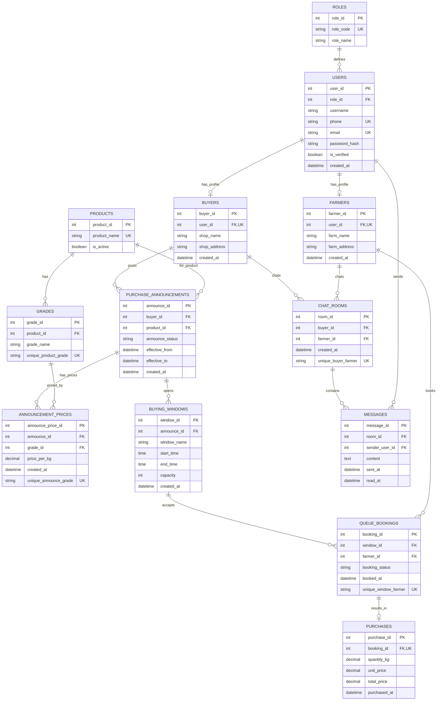

# components/pricegovernment (Mock)

โฟลเดอร์นี้ทำให้คุณ “เห็นผลลัพธ์ก่อน” โดยยังไม่ต้องมี Database / API จริง

## ลองดูผลลัพธ์เร็วที่สุด
เปิดไฟล์นี้ใน browser:
- demo.html

จากนั้น:
- ลาก/เลื่อน carousel ได้
- จุด (dots) เปลี่ยนตามหน้า
- คลิกไอคอน → ไปหน้า government-price-card.html พร้อม query ?commodity=...

## ใส่ในโปรเจกต์จริงของคุณ
1) วางโฟลเดอร์ `pricegovernment` ไว้ที่:
   `components/pricegovernment/`

2) ในหน้าที่ต้องการโชว์ carousel:
- include HTML: `components/pricegovernment/government-price.html`
- link CSS: `components/pricegovernment/government-price.css`
- include JS: `components/pricegovernment/government-price.js`

3) หน้าแสดงการ์ดราคา (ตอนนี้อยู่ในโฟลเดอร์เดียวกัน):
- `components/pricegovernment/government-price-card.html`

> ถ้าคุณอยากย้ายหน้าการ์ดไปไว้ใน pages/ ให้แก้ path ใน `government-price.js` ที่ฟังก์ชัน `openGovCard()`

## Mock data
แก้ข้อมูลจำลองได้ที่:
- mock-prices.js

(วันหลังพอมี backend/cron แล้ว ค่อยเปลี่ยน `government-price-card.js` ให้ fetch จาก API ของคุณ)

## Database ที่แนะนำจากทั้งโปรเจกต์

จาก flow ที่มีในโปรเจกต์นี้ (auth/register/login, profile, favorites, chat, notifications, buyer setbooking, farmer booking, government price) ฐานข้อมูลควรมีอย่างน้อย:

- auth/user: `roles`, `users`, `user_sessions`, `otp_requests`
- profile/account: `user_profiles`, `user_addresses`, `buyer_services`
- product/price: `commodities`, `commodity_varieties`, `gov_price_reports`, `gov_price_rows`
- buyer setbooking: `purchase_posts`, `purchase_post_grades`, `purchase_post_rounds`
- farmer booking: `bookings`, `booking_vehicles`, `booking_queue_status`
- social/engagement: `favorite_sellers`, `conversations`, `conversation_members`, `messages`, `notifications`, `reviews`

หมายเหตุ:
- ไฟล์ใน `js/account/*` หลายหน้าตอนนี้ยังเป็น placeholder แต่โครง DB ด้านบนเตรียมไว้รองรับการต่อยอด
- ปัจจุบันหลายหน้าบันทึกผ่าน `localStorage/sessionStorage` จึง mapping เป็น table จริงให้แล้วใน ERD ด้านล่าง

## ER Diagram Code (Normalized 3NF - แก้ความเชื่อมจากรูป)

ชุดนี้ออกแบบตามรูปที่แนบ แต่ปรับให้เป็น normalization ที่ถูกขึ้น (3NF) และแก้เส้นเชื่อมที่พบบ่อยว่าผิด:

- ตัดข้อมูลซ้ำ: เบอร์โทรหลักเก็บที่ `USERS` ไม่ซ้ำใน buyer/farmer
- ราคาแยกเป็นตารางกลาง `ANNOUNCEMENT_PRICES` (announce x grade)
- คิวจองต้องผูก `BUYING_WINDOWS` โดยตรง
- ผลการซื้อ (`PURCHASES`) ต้องเกิดจากการจอง (`QUEUE_BOOKINGS`) เท่านั้น
- แชทผูกเป็นคู่ buyer-farmer ผ่าน `CHAT_ROOMS` และข้อความอยู่ใน `MESSAGES`

วิธีใช้ใน draw.io:
1. เปิด diagrams.net (draw.io)
2. ไปที่ `Arrange` -> `Insert` -> `Advanced` -> `Mermaid`
3. วางโค้ดนี้แล้วกด `Insert`

