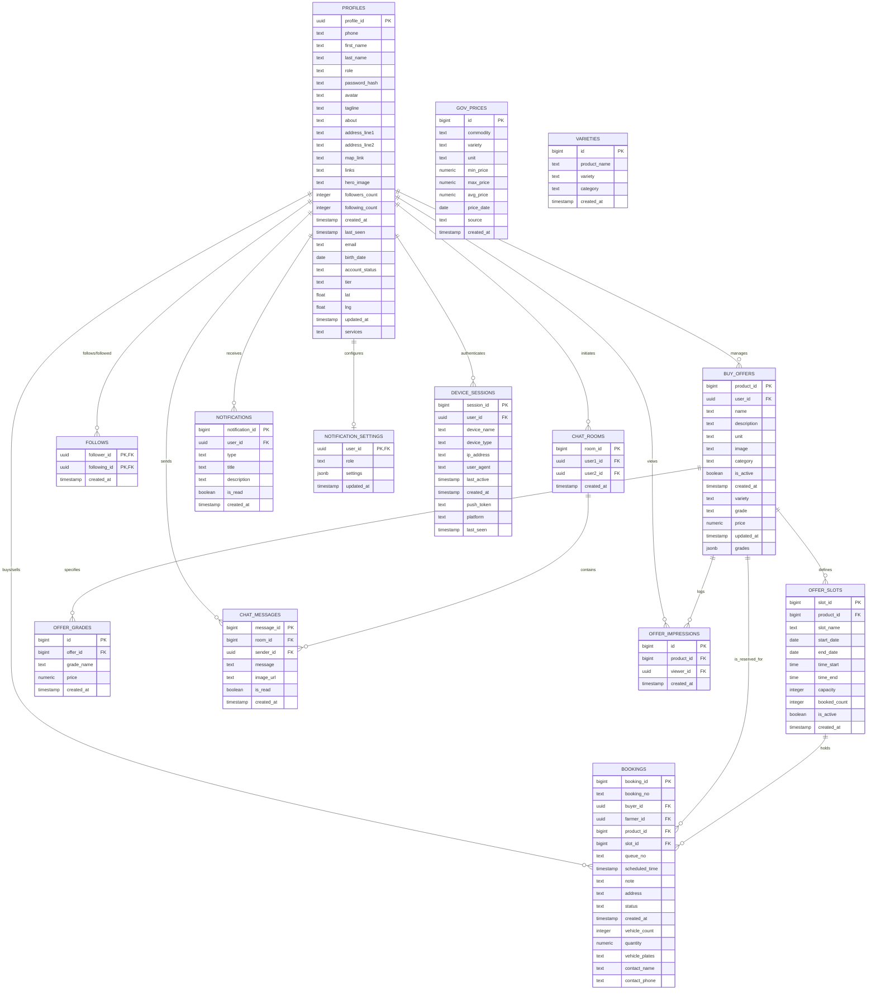

# AgriPrice Database - Entity-Relationship Diagram (ERD)

This document contains the Entity-Relationship Diagram (ERD) representing the normalized database structure of the AgriPrice platform in Mermaid syntax.

