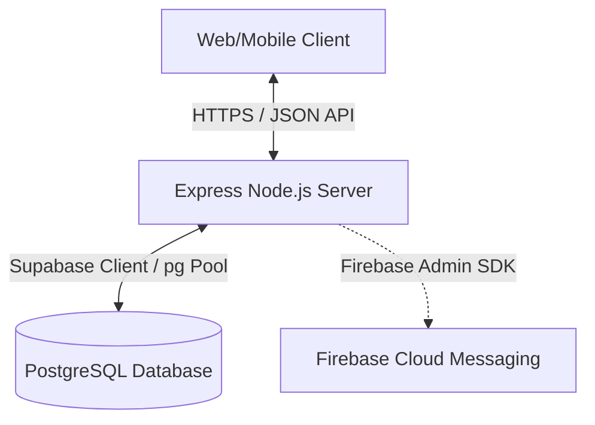
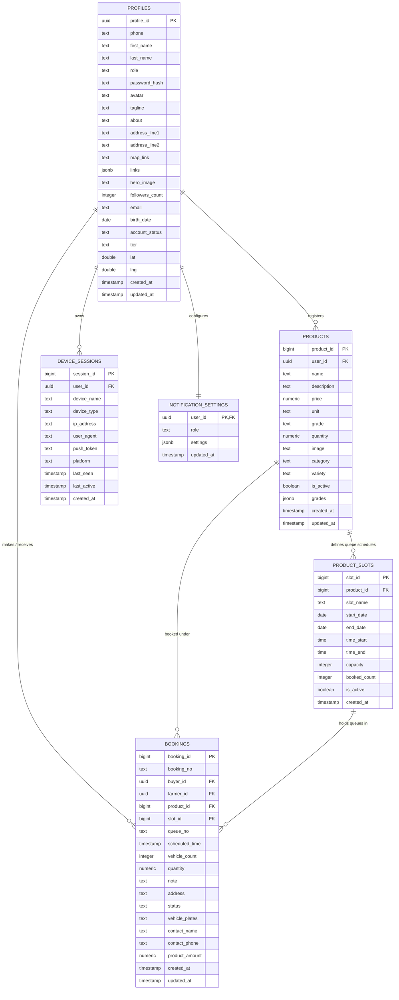

# AgriPrice System Audit and Refactoring Report

AgriPrice is a modernized queue-booking and agricultural commodity price tracking platform that connects local farmers with agricultural buying centers (Lhongs). This report details the technical audit, architectural design, database schema structure, key APIs, optimization steps, and system fixes implemented to ensure stability, security, and scalability.

---

## 1. Introduction
The primary goal of the AgriPrice system refactoring was to audit existing source code, optimize slow database queries, implement guards against query crashes, resolve critical onboarding and booking state bugs, and redesign the buyer dashboard interface to support a unified, tiered access model (Free vs. PRO).

---

## 2. System Design & Architecture
AgriPrice utilizes a modern web application stack optimized for mobile responsiveness and real-time operations:

- **Frontend**: A custom single-page-like experience using standard semantic HTML5, vanilla CSS3 (including theme variables for Light/Dark modes), and Vanilla JavaScript. Dynamic text translations are managed via a custom i18n client dictionary.
- **Backend**: Node.js and Express REST API server providing routes for products, slots, bookings, user profiles, device sessions, and notifications.
- **Database**: Supabase PostgreSQL database acting as the primary transactional datastore.
- **Push Notification Service**: Integrated Firebase Cloud Messaging (FCM) using the Admin SDK with automatic device session synchronization.



---

## 3. Database Entity Relationship Diagram (ERD) & Normalization
The database is structured in **Third Normal Form (3NF)** to ensure minimal redundancy and maximum consistency.

### Mermaid Entity-Relationship Diagram



### Table Normalization Details
1. **`profiles`**: Stores core user identification, role designations (`buyer`, `farmer`), location telemetry (lat, lng), and tier status (`free`, `pro`). Uniquely indexed.
2. **`products`**: Represents Lhong price offers and categories. Relies on `profiles` to determine owner. Contains structured `grades` (JSONB) to eliminate join tables for simple grading configurations.
3. **`product_slots`**: Tracks available booking schedules for products, checking round boundaries (dates, start/end times) and capacity.
4. **`bookings`**: Connects a farmer, buyer, product, and queue slot. Holds denormalized fields like contact names and phone numbers to capture the state of the booking at creation time (preventing historical profile changes from modifying previous booking receipts).
5. **`device_sessions`**: Tracks active authenticated logins and associated FCM push tokens.

---

## 4. Key API Endpoints
The following endpoints form the operational core of the system:

| Endpoint | Method | Middleware | Description |
| :--- | :--- | :--- | :--- |
| `/api/auth/verify-otp` | `POST` | *None* | Verifies OTP code and determines if user registration is complete. |
| `/api/auth/register-finish`| `POST` | *None* | Finalizes user profile registration with password hashes. |
| `/api/products` | `GET` | *Optional Auth*| Smart-search enabled endpoint returning active price announcements. |
| `/api/products/:id` | `GET` | *None* | Retrieves single product details (ID validated). |
| `/api/products/:id/slots` | `GET` | *None* | Retrieves round schedules for a given product (ID validated). |
| `/api/bookings` | `POST` | `auth` | Creates a new booking and updates slot occupancy. |
| `/api/dashboard` | `GET` | `auth` | Basic KPI statistics for buyer dashboard. |
| `/api/dashboard/pro-stats` | `GET` | `auth` | Advanced competitor and price analytics for PRO tier buyers. |
| `/api/notifications/push-token`| `POST` | `auth` | Registers or updates device FCM token. |

---

## 5. User Flows

### A. Farmer Booking Creation Flow
```
[Select Product] 
       │
       ▼
[Choose Date & Queue Round (Slot)]
       │
       ▼
[Fill Vehicle Info & Expected Crop Weight] (booking-step2.html)
       │
       ▼
[Review & Confirm Booking Summary] 
       │
       ▼
[Insert Booking & Increment slot.booked_count] 
       │
       ▼
[Generate Queue Number (e.g. Q-01) & Send FCM Notification to Buyer]
```

### B. Buyer Dashboard Tiered Access Flow
To drive PRO subscription conversions, the buyer dashboard has been unified:
1. **Authentication & Tier Query**: Upon login, the buyer's tier (`free` or `pro`) is retrieved.
2. **Tier-Adaptive Rendering**:
   - **Free Tier**: Basic metrics (Total Bookings, Success Rate, Booked Counts) are populated dynamically. Advanced charts (Price Comparisons, Area Competitors, Booking Analytics) are rendered but overlayed with a sleek, glassmorphic lock screen containing a call-to-action button to upgrade.
   - **PRO Tier**: Calls the specialized advanced statistics backend endpoint, unlocking all competitor maps, market price trends, and visual analytics dashboards.

---

## 6. Database Optimization & Indexes
To prevent server lag and database contention during high booking volume, missing performance indexes were added:

1. **`idx_bookings_product_id`** on `bookings(product_id)`:
   - *Impact*: Reduced join overhead when compiling product-level booking metrics and summary reports.
2. **`idx_profiles_email`** on `profiles(email)`:
   - *Impact*: Optimized account verification queries during login, speeding up index scans for users logging in via email addresses.
3. **Unique FCM Index on `device_sessions(user_id, push_token)`**:
   - *Impact*: Enables thread-safe upserts of push tokens without duplicate entries per device session.

---

## 7. Major Bugs Fixed

### 1. Booking Creation Column Mismatch
- **Symptoms**: Creating a booking resulted in SQL execution failures.
- **Cause**: The service was inserting input values into modern fields (`vehicle_info`, `expected_qty`) which did not exist in the legacy database schema.
- **Resolution**: Remapped insertion code in [bookingService.js](file:///c:/Users/pirap/Downloads/New%20folder/server/services/bookingService.js) to write to active columns: `vehicle_plates`, `product_amount`, `quantity`, `contact_name`, `contact_phone`, and `address`.

### 2. OTP Registration Limbo State
- **Symptoms**: New users who started registration but encountered an error/disconnection after Auth account creation could never complete signup. They were redirected to login but lacked profile credentials (e.g. password hash).
- **Cause**: `authService.verifyOtp` defined `isNewUser` solely based on whether a Supabase Auth user existed in the authentication provider.
- **Resolution**: Refined check to check the presence of a finished `profiles.password_hash` record (`hasRegisteredProfile = !!(existing && existing.password_hash)`). Incomplete profiles are now correctly flagged as new users, allowing them to complete profile registration.

### 3. Route Casting Crash (HTTP 500)
- **Symptoms**: Passing string parameters (e.g. `/api/products/undefined` or invalid IDs) crashed the server.
- **Cause**: Backend attempted to query Supabase using the raw route parameter string, causing PostgreSQL type cast crashes (Bigint to Text).
- **Resolution**: Integrated numeric validations `isNaN(Number(req.params.id))` across all product and slot detail, update, delete, and creation endpoints in [products.js](file:///c:/Users/pirap/Downloads/New%20folder/server/routes/products.js) and [product-slots.js](file:///c:/Users/pirap/Downloads/New%20folder/server/routes/product-slots.js).

### 4. FCM Database Query Crash
- **Symptoms**: Booking creation would crash the backend on FCM push notification queries.
- **Cause**:
  - `fcmService.js` queried `device_sessions.push_token` which did not exist in the schema.
  - The query builder's promise-like return type did not support `.catch()` chaining directly, causing uncaught `TypeError` crashes.
- **Resolution**:
  - Added the missing `push_token`, `platform`, and `last_seen` columns to the `device_sessions` table with a unique constraint.
  - Replaced inline `.rpc().catch(...)` calls in `bookingService.js` with structured try/catch blocks to ensure that FCM notification failures never interrupt transaction processing.

### 5. UI Translation Audit
- **Symptoms**: UI displayed spelling/translation inconsistencies.
- **Resolution**: Replaced "ข้อมูลสถานพาหนะ" with "ข้อมูลยานพาหนะ" in [i18n.js](file:///c:/Users/pirap/Downloads/New%20folder/frontend/js/components/i18n.js) and [booking-step2.html](file:///c:/Users/pirap/Downloads/New%20folder/frontend/pages/farmer/booking/booking-step2.html) for accuracy.
